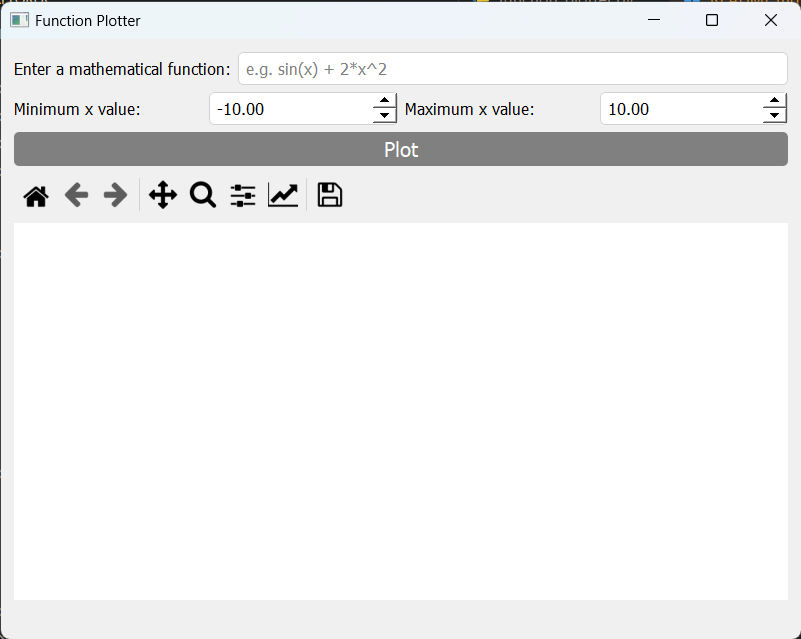
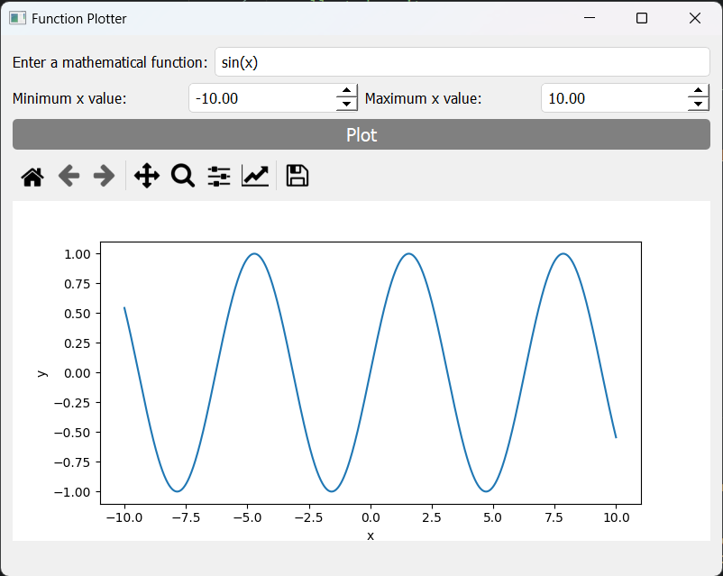
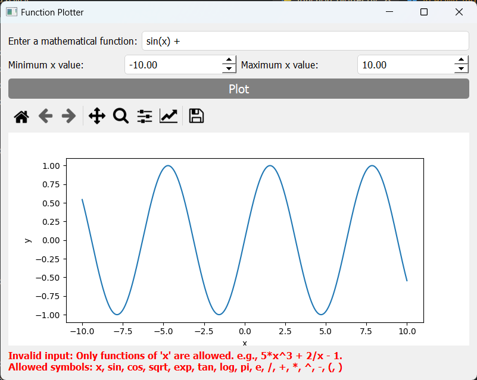
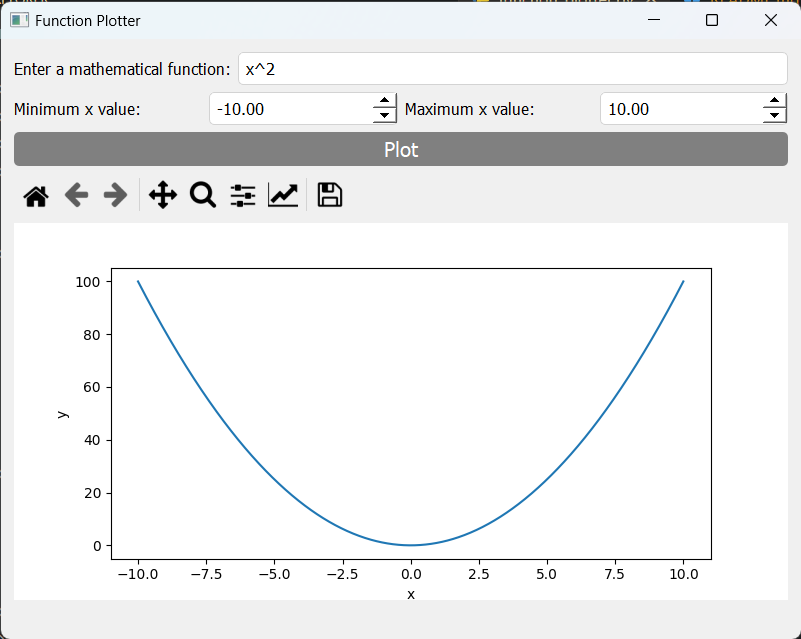
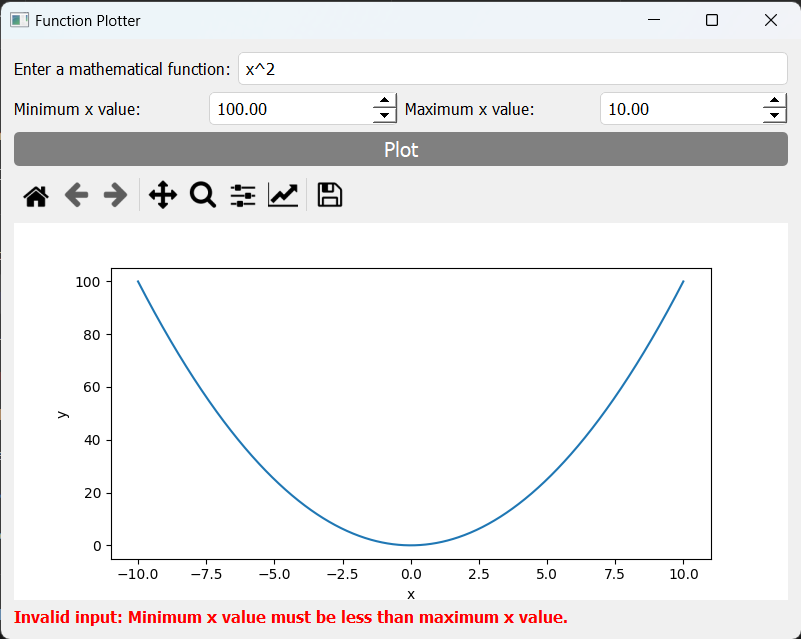

# Function Plotter

The **Function Plotter** is a graphical application built with PySide2 and Matplotlib that allows users to plot mathematical functions and visualize them in a graphical plot.

## Features

- Input a mathematical function and specify the range of x values to plot.
- Plot the function on a graph with the x-axis representing the input range and the y-axis representing the corresponding function values.
- Display warnings for invalid inputs or errors in function evaluation.

## Requirements

To run the program, you need to have the following dependencies installed:

- PySide2
- Matplotlib
- NumPy

You can install these dependencies using the following command:

```shell
pip install PySide2 matplotlib numpy
```

## Usage

1. Run the program by executing the script.

```shell
python function_plotter.py
```

2. The _Function Plotter_ window will appear.

3. Enter a mathematical function into the text input labeled "Enter a mathematical function." For example, you can input `sin(x) + 2*x^2`.

4. Specify the minimum and maximum values for the x-axis range by adjusting the corresponding spin boxes.

5. Click the **Plot** button or press Enter in the input text box to generate the plot.

6. The plot will be displayed in the graph area below the input section.

7. If there are any errors in the input or function evaluation, a warning message will be shown indicating the issue.

8. To exit the application, close the window.

## Running Tests

To run the tests for the Function Plotter program, follow these instructions:

1. Make sure you have installed the required dependencies mentioned in the "Requirements" section.

2. Open a terminal or command prompt.

3. Navigate to the directory where the `function_plotter_test.py` file is located.

4. Run the tests using the following command:

   ```shell
   pytest function_plotter_test.py
   ```

   The `pytest` command will automatically discover and execute the test cases defined in the file.

5. Wait for the tests to complete. You should see the test results displayed in the terminal, indicating whether each test case passed or failed.

   - If all the tests pass, you will see a message indicating the number of tests executed and that all tests passed.
   - If any tests fail, you will see detailed information about which tests failed and the reason for the failure.

   For example:

   ```
   ============================= test session starts =============================
   ...
   collected 10 items

   function_plotter_test.py ............

   ========================== 10 passed in 1.23 seconds ==========================
   ```

   This indicates that all 10 tests passed successfully.

## Screenshots






